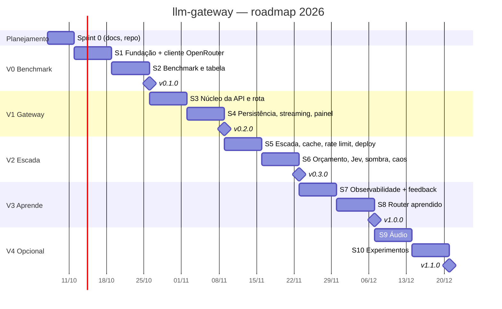

# Roadmap — llm-gateway

Horizonte: outubro a dezembro de 2026. Cadência de **sprints de 1 semana** (segunda a domingo).
As datas são uma proposta e devem ser revisadas na revisão de cada sprint.

## Visão geral

| Fase | Objetivo | Sprints | Release | Data alvo |
|---|---|---|---|---|
| **Sprint 0** | Planejamento, documentação, repositório | S0 | — | 11/10/2026 |
| **V0 — Benchmark** | Saber, com dado, se rotear vale a pena antes de construir (16 modelos, OpenRouter Auto e Jev Router) | S1–S2 | `v0.1.0` | 25/10/2026 |
| **V1 — Gateway funcional** | API compatível com OpenAI, regra fixa, registro, painel simples | S3–S4 | `v0.2.0` | 08/11/2026 |
| **V2 — Escada e resiliência** | Escada com checagem, cache, orçamento, rate limit, Jev, caos, deploy | S5–S6 | `v0.3.0` | 22/11/2026 |
| **V3 — Aprende + observabilidade** | Router aprendido, feedback, Prometheus, OpenTelemetry | S7–S8 | `v1.0.0` | 06/12/2026 |
| **V4 — Áudio e experimentos** *(opcional)* | Voz, APIs diretas, cache semântico, 2º benchmark | S9–S10 | `v1.1.0` | 20/12/2026 |

**MVP de portfólio = `v1.0.0` (8 sprints).** A V4 só entra se o MVP estiver fechado e publicado.

## Marcos e dependências externas

| Marco | Data | Dependência |
|---|---|---|
| Repositório `llm-gateway` criado e com acesso | até 11/10 | Leandro |
| Chave do OpenRouter com crédito (~US$ 10) | até 18/10 | Leandro |
| Caminho do gabarito do iRacingEng (58 perguntas) | até 18/10 | Leandro |
| Primeiro resultado do Jev (para o post no LinkedIn) | 25/10 | Fim da S2 |
| Revisão humana de 10 respostas por modelo | S2 | Leandro (~1 h) |
| Checkpoint do iRacingEng | 02–08/11 | Coincide com S4: teste do iRacingEng no gateway só **local** |
| Ok para deploy na VPS e ligação do iRacingEng | S5 | Leandro (após o checkpoint) |

## Métricas de sucesso

| Métrica | Como mede | Meta |
|---|---|---|
| Custo por resposta correta | Benchmark no conjunto de teste | Menor que Sonnet 5.5 sozinho, com acerto no máximo 5 pontos abaixo do melhor |
| Comparação com o mercado | Mesma tabela, linhas `openrouter/auto` e Jev Router | Publicar o resultado, ganhe ou perca |
| Sobrecarga do gateway | k6 com upstream simulado | Meta inicial p95 < 50 ms (revisar após a 1ª medição) |
| Resiliência | Testes de caos | Gateway responde com Redis fora e com Postgres fora |
| Qualidade de código | CI | ruff + mypy limpos, testes verdes em todo merge |

## Riscos

| Risco | Impacto | Mitigação |
|---|---|---|
| Conjunto de teste pequeno (29 perguntas) | Diferenças pequenas viram ruído | Publicar intervalo de confiança; 2º conjunto na V4 |
| Juiz LLM enviesado | Acerto inflado ou deflacionado | Juiz fixo, amostra humana e taxa de concordância publicada |
| Custo do benchmark passar do previsto | Gasto inesperado | Estimativa e confirmação antes de cada rodada paga |
| Modelo do plano indisponível no OpenRouter | Tabela incompleta | Substituto da mesma faixa, registrado no README |
| VPS de 8 GB compartilhada | Falta de memória | Orçamento de memória por container (ver INFRA.md) |
| Dependência do Jev (API paga, fechada) | Gateway parar se a API cair | Política plugável com tempo-limite e volta para a regra |
| Checkpoint do iRacingEng coincide com a S4 | Atraso na integração | Integração da S4 é só local; produção fica para a S5 |
| Escopo crescer (V4) | Projeto não terminar | V4 opcional; MVP fecha na `v1.0.0` |
